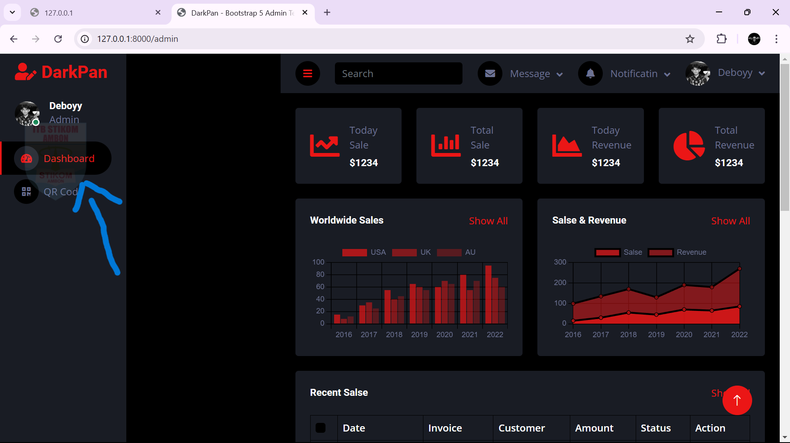

<p align="center"><a href="https://laravel.com" target="_blank"></a></p>

<p align="center">
<a href="https://github.com/laravel/framework/actions"></a>
<a href="https://packagist.org/packages/laravel/framework"></a>
<a href="https://packagist.org/packages/laravel/framework"></a>
<a href="https://packagist.org/packages/laravel/framework"></a>
</p>

## Laravel Project

Proyek Laravel yang meliputi instalasi Laravel Breeze, proteksi XSS, logo sebagai watermark, pembuatan QR Code untuk tanda tangan digital, dan integrasi reCAPTCHA di Laravel.

### Soal 8: Laravel Breeze

1. Persiapan Awal
Pastikan sistem Anda memiliki:
- PHP (versi terbaru direkomendasikan)
- Composer
- Node.js dan NPM

Jika belum menginstal Laravel, buat proyek baru dengan perintah berikut:
```
composer create-project laravel/laravel project-name
```
Setelah itu, masuk ke dalam direktori proyek dengan perintah:
```
cd project-name
```

2. Instalasi Laravel Breeze
Jalankan perintah berikut untuk menginstal Laravel Breeze:
```
composer require laravel/breeze --dev
php artisan breeze:install
```

3. Instalasi Dependensi Frontend (Opsional)
Setelah Laravel Breeze terpasang, jalankan perintah berikut untuk menginstal dependensi frontend:
```
npm install
npm run dev
```

4.  Migrasi Database
Pastikan sudah mengonfigurasi file .env dengan kredensial database yang sesuai:
```
DB_CONNECTION=mysql
DB_HOST=127.0.0.1
DB_PORT=3306
DB_DATABASE=nama_database
DB_USERNAME=root
DB_PASSWORD=password
```
Lalu jalankan perintah migrasi:
```
php artisan migrate
```
5.  Menjalankan Server
```
php artisan serve
```
Akses aplikasi di http://127.0.0.1:8000.


### Soal 9: Proteksi XSS 
1. Membuat Middleware Baru
 ```
php artisan make:middleware XSSProtection
```
Buka file app/Http/Middleware/XSSProtection.php dan ubah isinya menjadi:
&&&


2. Daftarkan Middleware
Daftarkan middleware ini di file bootstrap/app.php:
```
<?php

use Illuminate\Foundation\Application;
use Illuminate\Foundation\Configuration\Exceptions;
use Illuminate\Foundation\Configuration\Middleware;

return Application::configure(basePath: dirname(__DIR__))
    ->withRouting(
        web: __DIR__.'/../routes/web.php',
        commands: __DIR__.'/../routes/console.php',
        health: '/up',
    )
    ->withMiddleware(function (Middleware $middleware) {
        //
    })
    ->withExceptions(function (Exceptions $exceptions) {
        //
    })->create();
```

4. Pastikan Route Benar
Tambahkan route di routes/web.php:
```
Route::get('/xss-form', [XSSController::class, 'showForm'])->name('xss.form');
Route::post('/submit-comment', [XSSController::class, 'sanitizeInput'])->name('submit.comment');
```

4. Implementasi XSSController
Buka file app/Http/Controllers/XSSController.php dan tambahkan kode berikut:
```
<?php

namespace App\Http\Controllers;

use Illuminate\Http\Request;

class XSSController extends Controller
{
    public function showForm()
    {
        return view('xss.form'); 
    }

    public function sanitizeInput(Request $request)
    {
        $sanitizedData = htmlspecialchars($request->input('comment'), ENT_QUOTES, 'UTF-8');

        return response()->json([
            'original' => $request->input('comment'),
            'sanitized' => $sanitizedData,
            'message' => 'Input berhasil disanitasi!'
        ]);
    }
}
```

6. Membuat View Form
Pastikan file resources/views/xss/form.blade.php ada, dan buat dengan isi berikut:
```
<!DOCTYPE html>
<html lang="id">
<head>
    <meta charset="UTF-8">
    <meta name="viewport" content="width=device-width, initial-scale=1.0">
    <title>Form Proteksi XSS</title>
</head>
<body>
    <h2>Form Input dengan Proteksi XSS</h2>
    <form action="{{ route('submit.comment') }}" method="POST">
        @csrf
        <label for="comment">Komentar:</label><br>
        <textarea name="comment" id="comment" rows="5"></textarea><br>
        <button type="submit">Kirim</button>
    </form>
</body>
</html>
```
Akses halaman di browser:
Input form: http://127.0.0.1:8000/xss-form

Tampilan Input:

Tampilan Output:


### Soal 10: Logo Sebagai Watermark
1. Simpan Logo di Folder Public
Pastikan logo Anda disimpan dalam direktori public/images/logo.png agar mudah diakses oleh Laravel.

2. Menampilkan Logo di Halaman Login
Edit file Blade untuk halaman login, navbar, dan footer misalnya resources/views/auth/login.blade.php:
```

```
Dan kombinasikan dengan CSS begitupun pada navbar dan footer. 

Catatan: Tanda tangan digital berupa pdf data diri yang di upload pada google drive.

Tampilan login:


Tampilan Beranda/Navbar:


## Soal 11: Pembuatan QR Code
1. Instalasi Paket Simple QR Code
Instal paket Simple QR Code dengan Composer:
```
composer require simplesoftwareio/simple-qrcode
```

2. Membuat Controller untuk QR Code
Buat controller menggunakan perintah artisan:
```
php artisan make:controller QRCodeController
```

Di dalam QRCodeController.php, tambahkan kode berikut:
```
<?php

namespace App\Http\Controllers;

use Illuminate\Http\Request;
use SimpleSoftwareIO\QrCode\Facades\QrCode;
use Illuminate\Support\Facades\Storage;

class QRCodeController extends Controller
{
    public function showForm()
    {
        return view('codeqr');
    }

    public function generate(Request $request)
    {
        $request->validate([
            'url' => 'required|url',
            'size' => 'required|integer|min:100|max:1000',
            'format' => 'required|in:svg,png',
        ]);

        $url = $request->input('url');
        $size = $request->input('size');
        $format = $request->input('format');

        $fileName = 'qrcode_' . time() . '.' . $format;
        $path = "qrcodes/$fileName";

        $qrCode = QrCode::format($format)->size($size)->generate($url);

        Storage::disk('public')->put($path, $qrCode);

        $fileUrl = asset("storage/$path");

        return back()->with([
            'qr_code' => $format === 'svg' ? $qrCode : null, 
            'file_url' => $fileUrl,
            'file_path' => $path,
        ]);
    }

    public function download($fileName)
    {
        $path = storage_path("app/public/qrcodes/$fileName");

        if (file_exists($path)) {
            return response()->download($path);
        } else {
            return abort(404);
        }
    }
}
```
3. Menambahkan Route
Tambahkan route untuk mengakses method yang baru saja dibuat di routes/web.php.
```
Route::get('/qrcode', [QRCodeController::class, 'showForm'])->name('qrcode.form'); /
Route::post('/generate-qrcode', [QRCodeController::class, 'generate'])->name('qrcode.generate'); 
Route::get('/qrcode/download/{fileName}', [QRCodeController::class, 'download'])->name('qrcode.download');
```

4. Membuat View untuk Menampilkan QR Code
Buat file resources/views/codeqr.blade.php dengan isi berikut:
```
@extends('layouts.app')

@section('content')
<div class="text-center">
    <h2 class="text-4xl font-bold" style="font-size: 2rem !important;">🔗 QR Code Generator</h2><br>

    <form action="{{ route('qrcode.generate') }}" method="POST">
        @csrf
        <label>Masukkan URL:</label>
        <input type="text" name="url" required>

        <label>Ukuran QR Code:</label>
        <select name="size">
            <option value="200">Kecil (200x200)</option>
            <option value="300" selected>Sedang (300x300)</option>
            <option value="500">Besar (500x500)</option>
        </select>

        <label>Format QR Code:</label>
        <select name="format">
            <option value="svg" selected>SVG</option>
            <option value="png">PNG</option>
        </select>

        <button type="submit">🎯 Generate QR Code</button>
    </form><br><br><br>

    @if (session('qr_code'))
        <div class="mt-4 flex justify-center">
            {!! session('qr_code') !!}
        </div>
    @endif<br><br>

    @if (session('file_url'))
        <div class="mt-4 flex justify-center">
            <br>
            <a href="{{ route('qrcode.download', basename(session('file_path'))) }}" class="btn btn-primary">
                ⬇️ Unduh QR Code
            </a>
        </div>
    @endif
</div>
@endsection
```

Akses di browser untuk melihat QR Code yang berisi data tanda tangan digital: http://localhost/codeqr

catatan: tanda tangan digital saya upload berupa sebuah pdf data diri pada google drive

Tampilan input:


Tampilan Output:


PDF yang berisi tanda tangan digital:


### Soal 12: Integrasi reCAPTCHA di Laravel
1. Membuat Kunci reCAPTCHA di Google
Kunjungi halaman Google reCAPTCHA.
Pilih jenis reCAPTCHA (misalnya v2 Checkbox).
Daftarkan nama situs web Anda dan tambahkan domain seperti localhost untuk pengembangan lokal.
Dapatkan Site Key dan Secret Key.
&&&

2. Instalasi Paket Mews\Captcha
Instal paket Mews\Captcha dengan Composer:
```
composer require mews/captcha
```

3. Publikasikan Konfigurasi
Publikasikan konfigurasi dengan perintah:
```
php artisan vendor:publish --provider="Mews\Captcha\CaptchaServiceProvider"
```

4. Konfigurasi .env untuk reCAPTCHA
Tambahkan kunci reCAPTCHA yang Anda dapatkan sebelumnya di file .env:
```
RECAPTCHA_SITE_KEY=6LdjrdgqAAAAAIXq_TAyo4xRQgjljj6qEwxhDNlP
RECAPTCHA_SECRET_KEY=6LdjrdgqAAAAAL0XqR1jAK_cybWl699hohIcyxpN
``

6. Menyiapkan Route untuk Menampilkan dan Refresh Captcha
Tambahkan route di routes/web.php untuk menampilkan dan me-refresh captcha tanpa me-reload halaman:
```
Route::get('/captcha', function () {
    return Captcha::create('default');
})->name('captcha');

Route::get('/refresh-captcha', function (Request $request) {
    return response()->json(['captcha' => captcha_src('default') . '?' . time()]);
});
```

6. Menambahkan Captcha ke Form Register dan Login
Edit form login di resources/views/auth/register.blade.php dan resources/views/auth/login.blade.php untuk menambahkan captcha:
```
<div class="mt-4">
    <x-input-label for="captcha" :value="__('Masukkan Captcha')" />
    <div class="flex items-center">
        
        <button type="button" onclick="refreshCaptcha()" class="ml-2 p-1 bg-gray-300 dark:bg-gray-700 rounded">🔄</button>
    </div>
    <x-text-input id="captcha" class="block mt-2 w-full" type="text" name="captcha" required />
    <x-input-error :messages="$errors->get('captcha')" class="mt-2 text-red-600" />
</div>
```

Tambah script untuk refresh captcha:
```
<script>
    function refreshCaptcha() {
        fetch('/refresh-captcha')
            .then(response => response.json())
            .then(data => {
                document.querySelector('.captcha-img').src = data.captcha;
            });
    }
</script>
```

7. Validasi Captcha di Controller
Edit AuthenticatedSessionController.php untuk menambahkan validasi captcha:
```
<?php

namespace App\Http\Controllers\Auth;

use App\Http\Controllers\Controller;
use App\Http\Requests\Auth\LoginRequest;
use Illuminate\Http\RedirectResponse;
use Illuminate\Http\Request;
use Illuminate\Support\Facades\Auth;
use Illuminate\View\View;

class AuthenticatedSessionController extends Controller
{
    /**
     * Display the login view.
     */
    public function create(): View
    {
        return view('auth.login');
    }

    /**
     * Handle an incoming authentication request.
     */
    public function store(LoginRequest $request): RedirectResponse
    {
        $request->authenticate();

        $request->session()->regenerate();

        return redirect()->intended(route('dashboard', absolute: false));
    }

    /**
     * Destroy an authenticated session.
     */
    public function destroy(Request $request): RedirectResponse
    {
        Auth::guard('web')->logout();

        $request->session()->invalidate();

        $request->session()->regenerateToken();

        return redirect('/');
    }
}
```

Buka RegisteredUserController.php dan tambahkan validasi captcha pada method store():
```
<?php

namespace App\Http\Controllers\Auth;

use App\Http\Controllers\Controller;
use App\Models\User;
use Illuminate\Auth\Events\Registered;
use Illuminate\Http\RedirectResponse;
use Illuminate\Http\Request;
use Illuminate\Support\Facades\Auth;
use Illuminate\Support\Facades\Hash;
use Illuminate\Support\Facades\Http;
use Illuminate\Validation\Rules;
use Illuminate\Validation\ValidationException; 
use Illuminate\View\View;

class RegisteredUserController extends Controller
{
    /**
     * Menampilkan tampilan registrasi pengguna.
     */
    public function create(): View
    {
        return view('auth.register');
    }

    /**
     * Menyimpan pengguna baru setelah melakukan registrasi.
     */
    public function store(Request $request): RedirectResponse
    {
        // Validasi input
        $request->validate([
            'name' => ['required', 'string', 'max:255'],
            'email' => ['required', 'string', 'lowercase', 'email', 'max:255', 'unique:users,email'],
            'password' => ['required', 'confirmed', Rules\Password::defaults()],
            'g-recaptcha-response' => ['required'],  // Validasi CAPTCHA
        ]);

        // Verifikasi reCAPTCHA
        $response = Http::asForm()->post('https://www.google.com/recaptcha/api/siteverify', [
            'secret' => env('RECAPTCHA_SECRET_KEY'),  // Pastikan secret key sudah diatur di .env
            'response' => $request->input('g-recaptcha-response')
        ]);

        if (!$response->json()['success']) {
            // Jika verifikasi CAPTCHA gagal, lemparkan error
            throw ValidationException::withMessages(['captcha' => 'Verifikasi Captcha gagal.']);
        }

        // Buat user baru setelah validasi dan CAPTCHA berhasil
        $user = User::create([
            'name' => $request->name,
            'email' => $request->email,
            'password' => Hash::make($request->password),
        ]);

        // Event setelah registrasi berhasil
        event(new Registered($user));

        // Login otomatis pengguna yang baru saja terdaftar
        Auth::login($user);

        // Redirect ke dashboard setelah registrasi dan login sukses
        return redirect()->route('dashboard');
    }
}
```

6. Menambahkan Route untuk Menampilan dan Refresh Captcha
Edit routes/web.php untuk membuat tampilan dan route refresh captcha:
```
Route::get('/captcha', function () {
    return Captcha::create('default');
})->name('captcha');

// Route untuk Refresh Captcha tanpa Reload
Route::get('/refresh-captcha', function (Request $request) {
    return response()->json(['captcha' => captcha_src('default') . '?' . time()]);
});
```

Akses halaman registrasi di http://localhost:8000/login.


The Laravel framework is open-sourced software licensed under the [MIT license](https://opensource.org/licenses/MIT).


The Laravel framework is open-sourced software licensed under the [MIT license](https://opensource.org/licenses/MIT).
